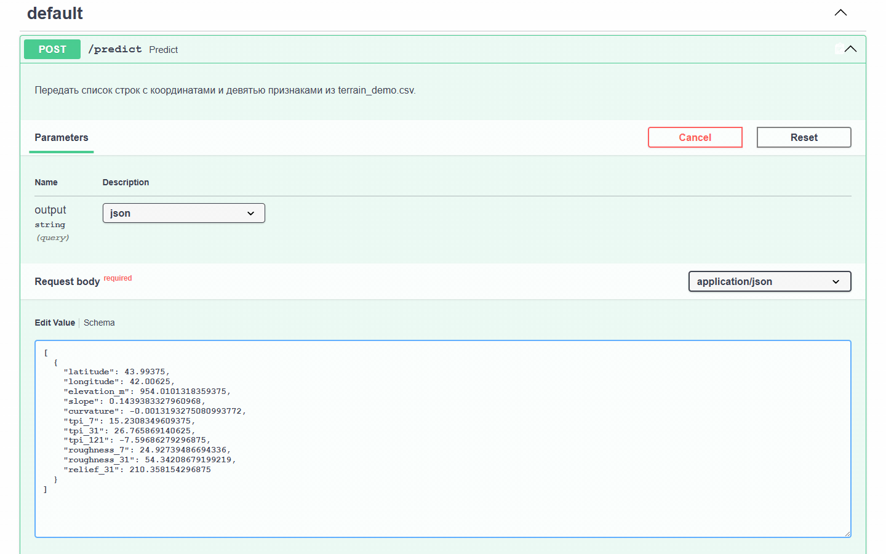
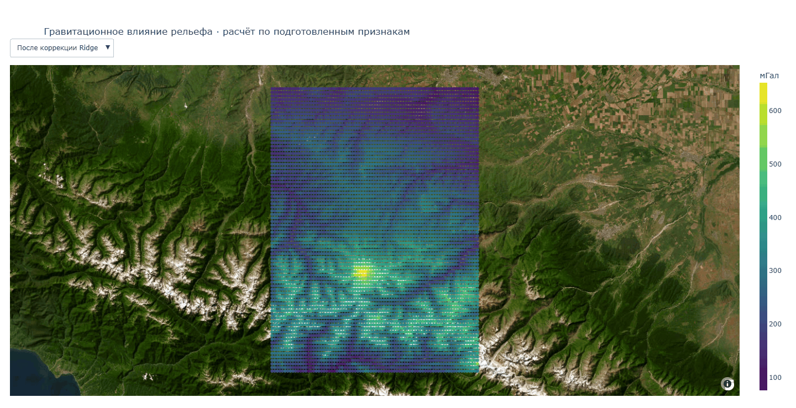

# 🏔️ Гравитационное влияние рельефа: бэкенд и API

[Открыть облачный API](https://gravity-api-service.fastapicloud.dev/docs)

## 🎯 О проекте

**Бэкенд.** Проект реализует **бэкенд-сервис** для расчёта гравитационного влияния рельефа. Бэкенд — это серверная часть приложения: она принимает данные, выполняет расчёты и возвращает готовый результат клиенту.

**Расчёт.** В расчёте используется **линейная регрессия с L2-регуляризацией (Ridge)**: модель получает девять характеристик рельефа и прогнозирует поправку к исходной аппроксимации. Результаты выражены в **мГал**.

**API.** Доступ к бэкенду организован через **API**, поэтому расчёт можно вызывать из Python-программы, мобильного приложения или веб-интерфейса. Саму модель и её библиотеки устанавливать на стороне клиента не нужно.

**Ограничения.** Сервис работает с заранее подготовленными признаками рельефа, а не с произвольной ЦМР или только координатами. SRTM2gravity используется как расчётное опорное поле; для других территорий качество модели необходимо проверять отдельно.

---

## 🎬 Примеры работы

### Запрос к API

Встроенная страница `/docs` позволяет отправить JSON с признаками рельефа и увидеть числовой ответ без написания отдельного клиента. В демонстрации используется локальный сервер; облачный API имеет такой же интерфейс.



### Интерактивная карта

Результат расчёта для 6400 точек Северного Кавказа: переключение исходного поля, поля после Ridge-коррекции и коррекции модели, изменение масштаба и просмотр значений в подсказках. Подложка — спутниковые снимки Esri World Imagery.



GIF показывает работу карты, но сама не является интерактивной. Для самостоятельного просмотра запустите `check_api.py` и откройте созданный `results/terrain_map.html`.

---

## 🧰 Структура

```text
Gravity_API/
├── data/
│   ├── terrain_demo.csv          # Координаты и признаки для расчёта
│   ├── terrain_reference.csv     # Опорные значения только для проверки
│   └── request_example.json      # Одна строка для запроса через /docs
├── models/
│   ├── terrain_model.joblib      # StandardScaler и Ridge, порядок признаков
│   └── model_info.json           # Источник, состав выборки и контрольные метрики
├── results/                     # CSV и HTML, создаваемые клиентом
├── assets/                      # GIF-демонстрации для README
├── gravity_backend.py           # Подготовка входа и применение модели
├── gravity_map.py               # Три переключаемых слоя карты
├── api.py                       # HTTP-доступ к расчёту
├── check_api.py                 # Пример клиента без Streamlit
├── pyproject.toml               # Python, зависимости и запуск в FastAPI Cloud
├── README.md                    # Описание и инструкции
├── .gitignore                   # Исключения для среды, кешей и результатов
└── requirements.txt
```

---

## 🚀 Локальный запуск

Скачайте проект через **Code → Download ZIP** на GitHub и распакуйте архив. Откройте папку проекта в VS Code. В терминале Windows создайте окружение на Python 3.12 и установите библиотеки:

```powershell
py -3.12 -m venv .venv
.venv\Scripts\python.exe -m pip install -r requirements.txt
```

Если PyPI недоступен, можно установить те же зависимости через зеркало:

```powershell
.venv\Scripts\python.exe -m pip install -r requirements.txt --index-url https://repo.huaweicloud.com/repository/pypi/simple
```

Сначала можно проверить бэкенд без сервера:

```powershell
.venv\Scripts\python.exe gravity_backend.py
```

Запустите API и оставьте этот терминал открытым:

```powershell
.venv\Scripts\python.exe -m uvicorn api:app --host 127.0.0.1 --port 8001
```

Откройте [http://127.0.0.1:8001/docs](http://127.0.0.1:8001/docs). В `POST /predict` нажмите **Try it out**, вставьте содержимое `data/request_example.json` в тело запроса и нажмите **Execute**. Формат `json` возвращает числа; `html` возвращает HTML-код интерактивной карты. Страница `/docs` показывает HTML как ответ API; для просмотра самой карты используйте клиент ниже.

Для обработки всей демонстрационной таблицы откройте второй терминал:

```powershell
.venv\Scripts\python.exe check_api.py
```

Клиент сохранит `results/terrain_predictions.csv` и `results/terrain_map.html`, затем откроет карту в браузере. При повторном запуске эти два файла заменяются. Для остановки API нажмите **Ctrl+C** в первом терминале.

На Linux и macOS используются `python3.12 -m venv .venv` и `.venv/bin/python` вместо команд Windows. При запуске с адресом `127.0.0.1` API доступен только на этом компьютере.

---

## ☁️ Работа с облачным API

Готовый сервис доступен по адресу [https://gravity-api-service.fastapicloud.dev/docs](https://gravity-api-service.fastapicloud.dev/docs). Для проверки через эту страницу устанавливать Python не нужно.

Чтобы обработать CSV клиентом `check_api.py` через облако, замените в нём одну строку:

```python
API_URL = "https://gravity-api-service.fastapicloud.dev/predict"
```

Затем запустите клиент обычной командой. Локальный сервер при этом не нужен: CSV и HTML сохранятся на вашем компьютере, а расчёт выполнится в облаке. В поле сервера мобильного приложения указывается базовый адрес **без `/predict`** — мобильный клиент добавляет этот путь сам.

Корневой адрес `/` может вернуть 404, поскольку отдельная главная страница не предусмотрена. Проверяйте сервис через `/docs`. Доступность публичного API зависит от работы платформы и условий размещения.

---

## 🌐 Публикация своего сервера

1. Создайте репозиторий GitHub с файлом **README.md**. Нажмите точку в английской раскладке, чтобы открыть редактор `github.dev`.
2. Добавьте модули, `requirements.txt`, `pyproject.toml`, папки `models` и `data`. Для отображения демонстраций в README также загрузите `assets`. Не загружайте `.venv`, `.runtime`, `__pycache__`, результаты расчётов и секреты.
3. Сохраните файлы через **Source Control → + → сообщение → Commit & Push**. Файлы `api.py` и `pyproject.toml` должны находиться в корне репозитория.
4. Войдите на [FastAPI Cloud](https://fastapicloud.com/) через GitHub, предоставьте доступ к нужному репозиторию и выберите его при создании приложения.
5. Оставьте **Root Directory** пустым. Для этого проекта переменные окружения не требуются. Нажмите **Create App**, дождитесь запуска и откройте полученный адрес с окончанием `/docs`.

Готовый `pyproject.toml` задаёт Python 3.12, зависимости и точку входа `api:app`: объект `app` из модуля `api.py`. Секция `tool.setuptools` перечисляет модули проекта. При изменении библиотек согласуйте версии в `requirements.txt` и `pyproject.toml`.

Если сборка не удалась, проверьте журнал: наличие файла модели, зависимости и конфигурацию. GitHub хранит файлы; Python-сервер запускает FastAPI Cloud. Подробнее: [подготовка проекта к FastAPI Cloud](https://fastapicloud.com/docs/getting-started/existing-project/).

---

## 📄 Входные данные

`terrain_demo.csv` содержит 6400 центров ячеек на участке Северного Кавказа `N43E042`. Они выбраны равномерно: каждая 15-я строка и колонка исходного растра, без отбора по ошибке модели. Географические координаты заданы в EPSG:4326.

| Столбец | Значение |
|---|---|
| `latitude`, `longitude` | Широта и долгота, градусы; используются для карты, не входят в Ridge |
| `elevation_m` | Высота, м |
| `slope` | Модуль градиента высоты, м/м; не угол в градусах |
| `curvature` | Сумма вторых производных высоты по принятой в блокноте формуле, 1/м |
| `tpi_7`, `tpi_31`, `tpi_121` | Высота ячейки минус средняя высота в окне 7×7, 31×31 или 121×121 ячеек, м |
| `roughness_7`, `roughness_31` | Стандартное отклонение высот в соответствующем окне, м |
| `relief_31` | Максимальная высота минус минимальная в окне 31×31, м |

Признаки рассчитаны в исходном пособии по Copernicus DEM GLO-90, приведённой к сетке 1/1200°; повторять их расчёт по прореженной демонстрационной таблице нельзя. Для собственных данных необходимы те же определения признаков, сетка, окна и единицы. `StandardScaler`, обученный вместе с Ridge, уже включён в модель: самостоятельно нормализовать входную таблицу не нужно.

---

## 📊 Результат

API принимает JSON-список строк и возвращает координаты и три значения:

- `baseline_mgal` — быстрая аппроксимация из пособия: притяжение слоя при плотности 2670 кг/м³ с поправочными членами по TPI;
- `correction_mgal` — остаток, предсказанный Ridge;
- `prediction_mgal` — сумма исходного расчёта и прогнозируемого остатка.

Параметр `output=html` переключает ответ на интерактивную карту. Слои «Исходный расчёт» и «После коррекции Ridge» имеют общую цветовую шкалу. Для «Коррекции модели» используется отдельная шкала, симметричная относительно нуля. Подсказка каждой точки показывает все три значения. Plotly встроен в HTML; картографическая подложка загружается из интернета.

Числовой и HTML-ответы доступны через один обработчик `/predict`. Демонстрационный клиент делает два запроса, поэтому расчёт выполняется дважды. Для небольшой Ridge-модели это допустимо и позволяет обойтись без хранения результатов разных пользователей на сервере.

---

Источники: [SRTM2gravity](https://ddfe.curtin.edu.au/gravitymodels/SRTM2gravity2018/), [описание набора SRTM2gravity](https://ddfe.curtin.edu.au/gravitymodels/SRTM2gravity2018/SRTM2gravity_Readme.dat), [Copernicus DEM GLO-90](https://registry.opendata.aws/copernicus-dem/).
